I am currectly a Postdoctoral Fellow (Shanghai Super Postdoctoral Fellow) at <a href="https://www.fudanroilab.com/"> Lab of Robotics Oriented Intelligence </a>, School of Computer Science, Fudan University, China, mentored by Prof. <a href="https://faet.fudan.edu.cn/e4/28/c23898a255016/page.htm"> Wenqiang Zhang </a>. I received my Ph.D. degree from School of Computer Science, Fudan University, China, in Jan. 2023, advised by Prof. <a href="https://faet.fudan.edu.cn/e4/28/c23898a255016/page.htm"> Wenqiang Zhang </a>. Before that, I received my bachelor and master degree and in mechanical engineering and automation from Qingdao University. My research interests focused object recognition, generative AI, visual reasoning, and embodied intelligence.

<!--

News and Olds
------
<ul>
  <li>[12/2024] One paper is accepted by AAAI2025. </li>

</ul>

--> 

Preprints
----
(✉️ indicates corresponding author, and † indicates equal contribution)
<table style="width:100%; border-collapse: collapse; border: none;">
  <tr>
    <th width="40%" style="border: none;">
      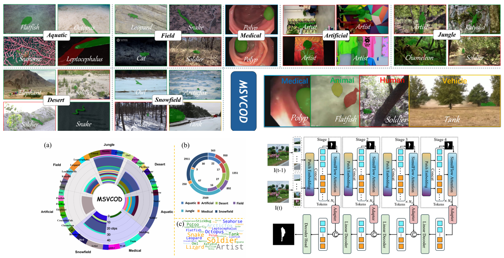
    </th>
    <th style="text-align:left; border: none;" width="60%">
            MSVCOD:A Large-Scale Multi-Scene Dataset for Video Camouflage Object Detection  
             <b>Shuyong Gao</b>, Yuang Feng, Qishan Wang, Lingyi Hong, Xinyu Zhou, Liu Fei, Yan Wang, Wenqiang Zhang✉️ 
             <em>arXiv preprint, 2025 (CVPR 2026 under review)</em>  
            [<a href="">Paper</a>][<a>Code</a>][<a href="https://shuyonggao.github.io/MSVCOD"> Project Page </a>]
    </th>
  </tr> 
</table>

<table style="width:100%; border-collapse: collapse; border: none;">
  <tr>
    <th width="40%" style="border: none;">
      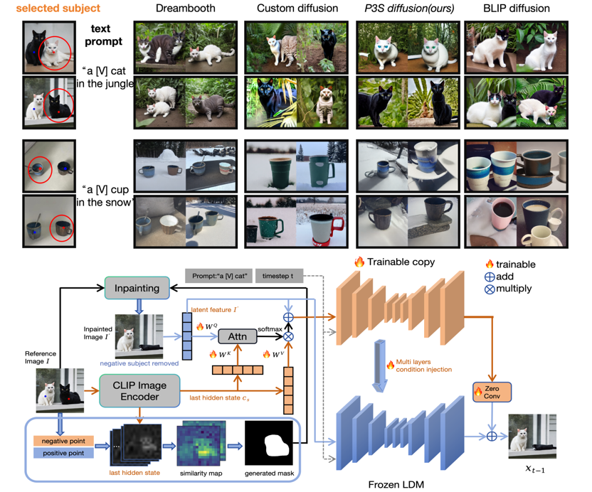
    </th>
    <th style="text-align:left; border: none;" width="60%">
            P3S-Diffusion:A Selective Subject-driven Generation Framework via Point Supervision  
            Junjie Hu, <b>Shuyong Gao✉️</b>, Lingyi Hong, Qishan Wang, Yuzhou Zhao, Yan Wang, Wenqiang Zhang✉️ 
             <em>arXiv preprint, 2024 (TNNLS under review)</em>  
            [<a href="">Paper</a>][<a>Code</a>][<a> Project Page </a>]
    </th>
  </tr> 
</table>

<table style="width:100%; border-collapse: collapse; border: none;">
  <tr>
    <th width="40%" style="border: none;">
      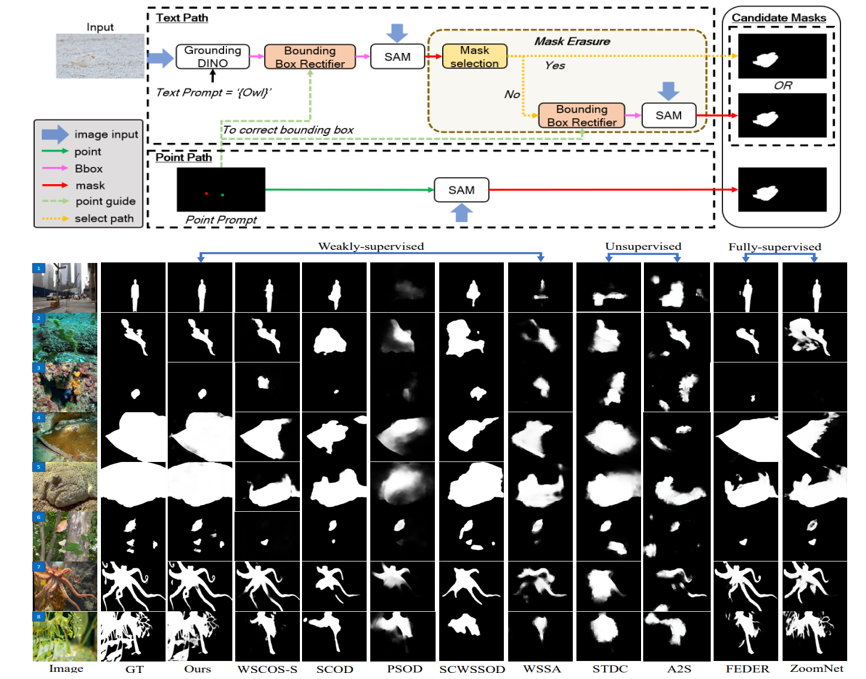
    </th>
    <th style="text-align:left; border: none;" width="60%">
            A Holistically Point-guided Text Framework for Weakly-Supervised Camouflaged Object Detection  
            Tsui Qin Mok†, <b>Shuyong Gao✉️†</b>, Haozhe Xing, Miaoyang He, Yan Wang, Wenqiang Zhang✉️ 
             <em> arXiv preprint, 2025 (IJCV under review) </em>  
            [<a href="https://arxiv.org/pdf/2501.06038">Paper</a>][<a href="https://github.com/shuyonggao/HPGT_WSCOD"> Code</a>][<a> Project Page </a>]
    </th>
  </tr> 
</table>

<table style="width:100%; border-collapse: collapse; border: none;">
  <tr>
    <th width="40%" style="border: none;">
      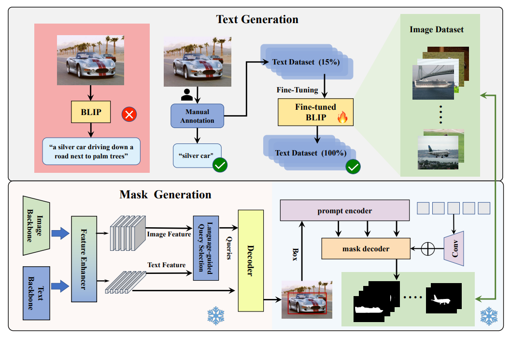
    </th>
    <th style="text-align:left; border: none;" width="60%">
            Boosting Salient Object Detection with Knowledge Distillated from Large Foundation Models  
            Miaoyang He, <b>Shuyong Gao✉️</b>, Tsui Qin Mok, Weifeng Ge, Wenqiang Zhang✉️ 
             <em> arXiv preprint, 2025 (TMM under review)</em>  
            [<a href="https://arxiv.org/abs/2501.04582">Paper</a>][<a> Code</a>][<a> Project Page </a>]
    </th>
  </tr> 
</table>

Selected Publications
------

<table style="width:100%; border-collapse: collapse; border: none;">
  <tr>
    <th width="40%" style="border: none;">
      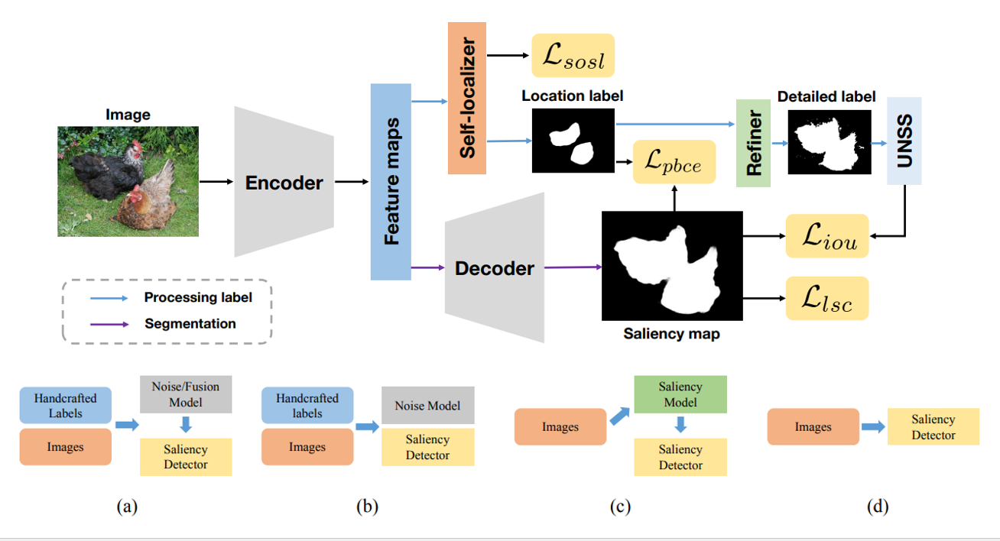
    </th>
    <th style="text-align:left; border: none;" width="60%">
            Towards End-to-End Unsupervised Saliency Detection with Self-Supervised Top-Down Context  
             Yicheng Song, <b>Shuyong Gao✉️</b>, Haozhe Xing, and Yiting Cheng, Yan Wang, Wenqiang Zhang✉️ 
             <em>ACM International Conference on Multimedia (ACM MM), 2023</em>  
            [<a href="https://arxiv.org/abs/2310.09533">Paper</a>][<a href="https://github.com/rejoicesyc/STC">Code</a>]
    </th>
  </tr> 
</table>

<table style="width:100%; border-collapse: collapse; border: none;">
  <tr>
    <th width="40%" style="border: none;">
      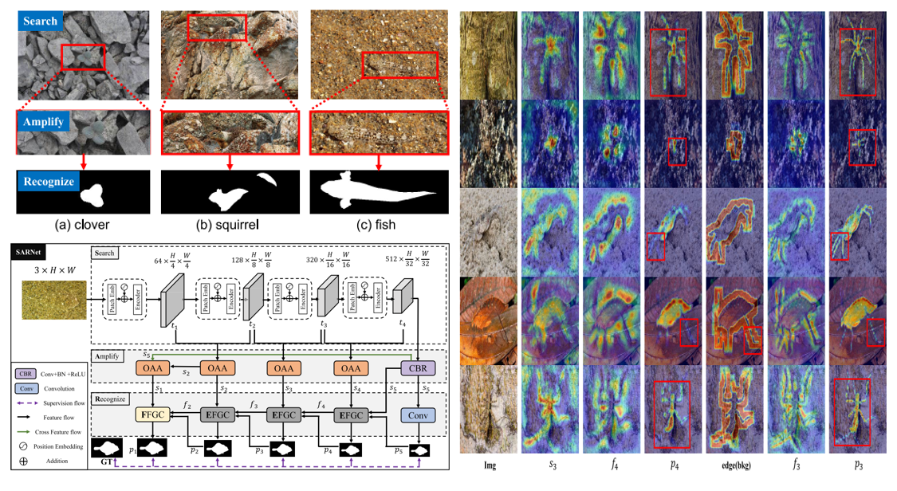
    </th>
    <th style="text-align:left; border: none;" width="60%">
            Go Closer to See Better: Camouflaged Object Detection via Object Area Amplification and Figure-Ground Conversion  
             Haozhe Xing, <b>Shuyong Gao✉️</b>, Xujun Wei, Hao Tang, Wenqiang Zhang✉️ 
             <em>IEEE Transactions on Circuits and Systems for Video Technology (IEEE T-CSVT), 2022</em>  
            [<a href="https://ieeexplore.ieee.org/abstract/document/10065514">Paper</a>][<a href="https://github.com/Haozhe-Xing/SARNet">Code</a>]
    </th>
  </tr> 
</table>

<table style="width:100%; border-collapse: collapse; border: none;">
  <tr>
    <th width="40%" style="border: none;">
      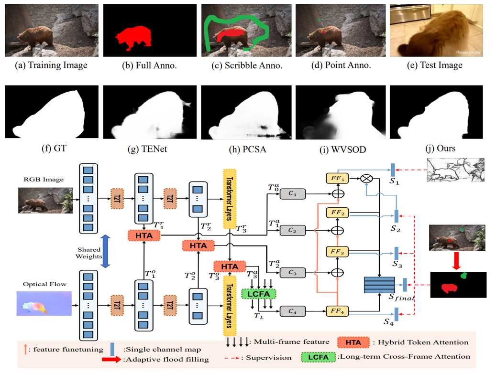
    </th>
    <th style="text-align:left; border: none;" width="60%">
            Weakly Supervised Video Salient Object Detection via Point Supervision  
             <b>Shuyong Gao</b>, Haozhe Xing, Wei Zhang, Yan Wang, Qianyu Guo, Wenqiang Zhang✉️ 
             <em>ACM International Conference on Multimedia (ACM MM), 2022</em>  
            [<a href="https://arxiv.org/abs/2207.07269">Paper</a>][<a href="https://github.com/shuyonggao/PVSOD">Code</a>]
    </th>
  </tr> 
</table>

<table style="width:100%; border-collapse: collapse; border: none;">
  <tr>
    <th width="40%" style="border: none;">
      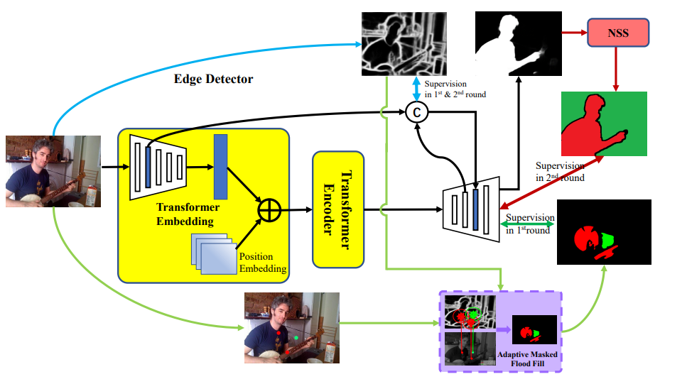
    </th>
    <th style="text-align:left; border: none;" width="60%">
            Weakly Supervised Salient Object Detection Using Point Supervision  
             <b>Shuyong Gao</b>, Wei Zhang✉️, Yan Wang, Qianyu Guo, Chenglong Zhang, Yangji He, Wenqiang Zhang✉️ 
             <em>AAAI Conference on Artificial Intelligence (AAAI), 2022</em>  
            [<a href="https://arxiv.org/abs/2203.11652">Paper</a>][<a href="https://github.com/shuyonggao/PSOD">Code</a>]
    </th>
  </tr> 
</table>

<table style="width:100%; border-collapse: collapse; border: none;">
  <tr>
    <th width="40%" style="border: none;">
      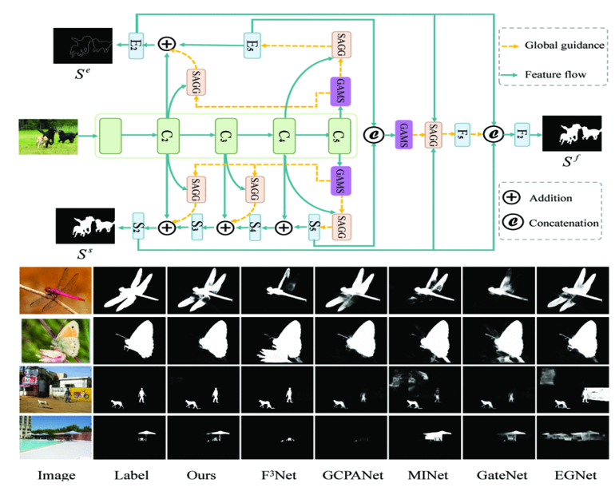
    </th>
    <th style="text-align:left; border: none;" width="60%">
            Dual-Stream Network Based On Global Guidance for Salient Object Detection  
             <b>Shuyong Gao</b>, Qianyu Guo, Wei Zhang, Wenqiang Zhang✉️, Zhongwei Ji  
             <em>IEEE International Conference on Acoustics, Speech and Signal Processing, 2021</em>  
            [<a href="https://ieeexplore.ieee.org/document/9413702">Paper</a>][<a href="https://github.com/shuyonggao/DSGGN">Code</a>]
    </th>
  </tr> 
</table>

<table style="width:100%; border-collapse: collapse; border: none;">
  <tr>
    <th width="40%" style="border: none;">
      
    </th>
    <th style="text-align:left; border: none;" width="60%">
            Correspondence-based Generative Bayesian Deep Learning for semi-supervised volumetric medical image segmentation  
             Yuzhou Zhao, Xinyu Zhou, Tongxin Pan, <b>Shuyong Gao✉️</b>, Wenqiang Zhang  
             <em>Computerized Medical Imaging and Graphics (2024)</em>  
            [<a href="https://www.sciencedirect.com/science/article/abs/pii/S0895611124000296">Paper</a>][<a href=" https://github.com/yumjoo/C-GBDL">Code</a>]
    </th>
  </tr> 
</table>

<table style="width:100%; border-collapse: collapse; border: none;">
  <tr>
    <th width="40%" style="border: none;">
      
    </th>
    <th style="text-align:left; border: none;" width="60%">
            Attention in attention for PET-CT modality consensus lung tumor segmentation  
             Yuzhou Zhao, Xinyu Zhou, Haijing Guo, Qianyu Guo, Yan Zuo, Shaoli Song, <b>Shuyong Gao✉️</b>, Wenqiang Zhang✉️  
             <em>IEEE International Conference on Multimedia and Expo (ICME), 2024</em>  
            [<a href="https://ieeexplore.ieee.org/abstract/document/10687909">Paper</a>][<a href="">Code</a>]
    </th>
  </tr> 
</table>

<table style="width:100%; border-collapse: collapse; border: none;">
  <tr>
    <th width="40%" style="border: none;">
      
    </th>
    <th style="text-align:left; border: none;" width="60%">
            A Casting Surface Dataset and Benchmark for Subtle and Confusable Defect Detection in Complex Contexts  
             Qishan Wang, Shuyong Gao, Li Xiong, Aili Liang, Kaidong Jiang, Wenqiang Zhang✉️  
             <em>IEEE Sensors Journal, 2024</em>  
            [<a href="https://ieeexplore.ieee.org/abstract/document/10687909">Paper</a>][<a href="https://github.com/18894269590/RSA">Code</a>]
    </th>
  </tr> 
</table>

<table style="width:100%; border-collapse: collapse; border: none;">
  <tr>
    <th width="40%" style="border: none;">
      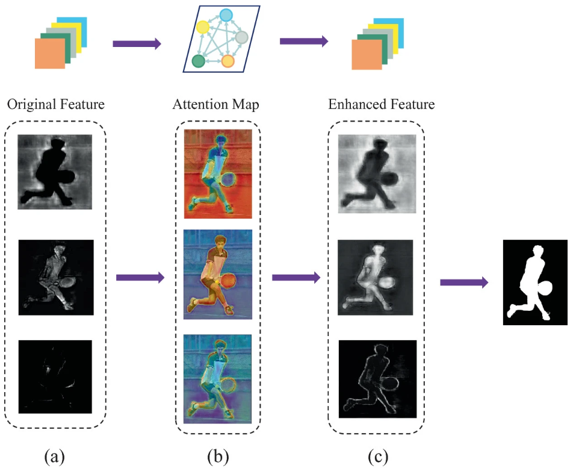
    </th>
    <th style="text-align:left; border: none;" width="60%">
            CRRNet: Channel Relation Reasoning Network for Salient Object Detection  
             <b>Shuyong Gao</b>, Haozhe Xing, Chenglong Zhang, Wenqiang Zhang✉️  
             <em>China Intelligent Robotics Annual Conference, 2022</em>  
            [<a href="https://link.springer.com/chapter/10.1007/978-981-99-0301-6_2#citeas">Paper</a>][<a href="https://github.com/shuyonggao/CRRNet">Code</a>]
    </th>
  </tr> 
</table>

<table style="width:100%; border-collapse: collapse; border: none;">
  <tr>
    <th width="40%" style="border: none;">
      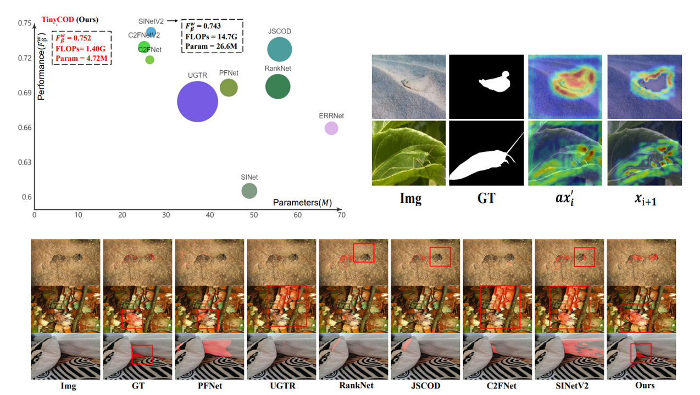
    </th>
    <th style="text-align:left; border: none;" width="60%">
            Tinycod:Tiny and Effective Model for Camouflage Object Detection  
             Haozhe Xing,  <b>Shuyong Gao✉️</b>, Hao Tang, Tsui Qin Mok, Yanlan Kang,  Wenqiang Zhang✉️  
             <em>IEEE International Conference on Acoustics, Speech and Signal Processing, 2023</em>  
            [<a href="https://ieeexplore.ieee.org/document/10095226">Paper</a>][<a href="https://github.com/Haozhe-Xing/TinyCOD?tab=readme-ov-file">Code</a>]
    </th>
  </tr> 
</table>

